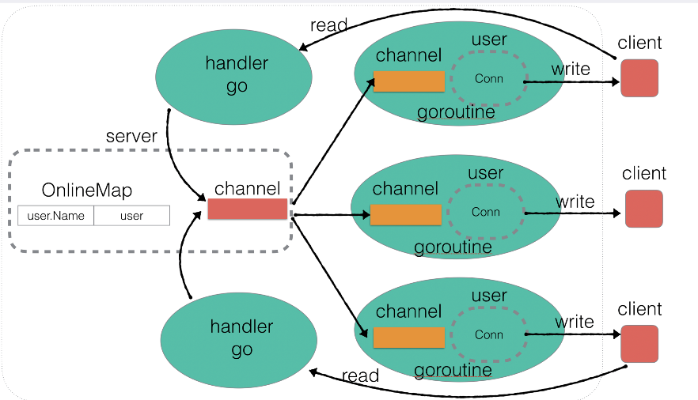

GOIMS is a simple TCP instant messaging system with the basic framework provided by [@aceld](https://github.com/aceld) and implemented by GO.

## Structure



## Functions

- Basic TCP server and client
- User online and offline events
- Public chat
- Private chat
- Update(change) username
- Timeout-enforced offline

## Build

**server**

```
cd goims-server
go build -o bin/server main.go
```

**client**

```
cd goims-client
go build -o bin/client main.go
```

## Run

**server (use 127.0.0.1:5090)**

```
cd goims-server/bin
./server
```

**client**

```
cd goims-client/bin
./client -ip <ip of the server> -port <port of the server> 
```